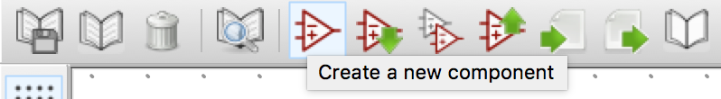
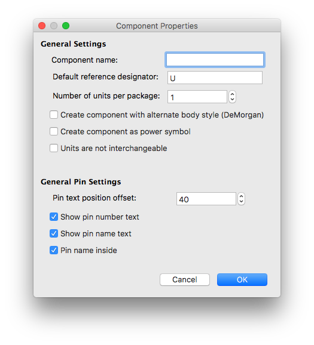
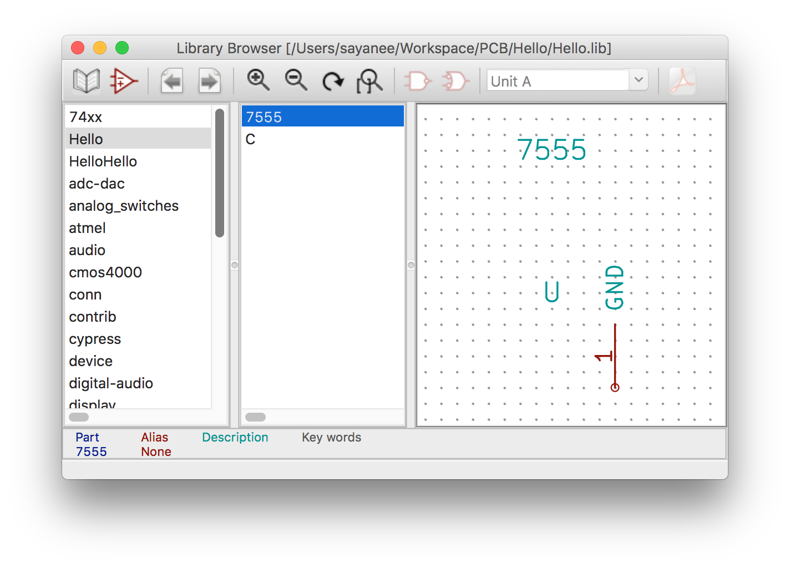
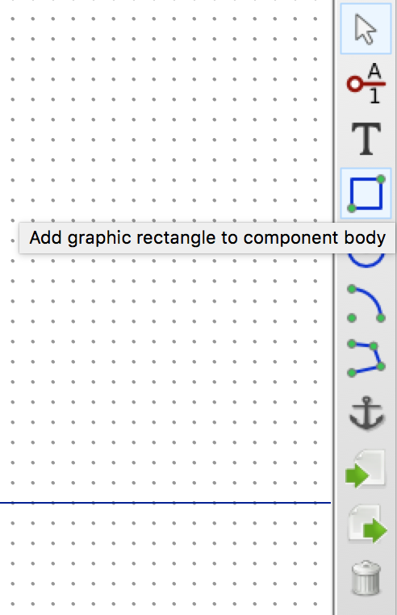
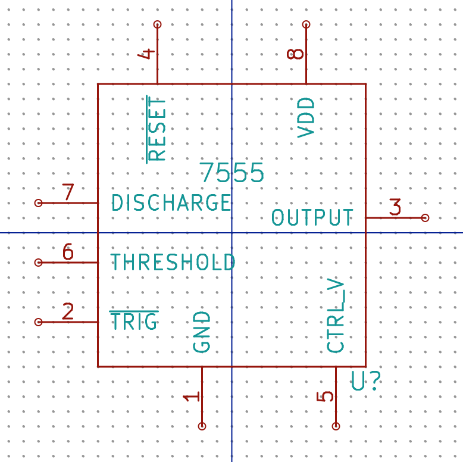

## Create component

1. Load the new library
1. Click `Create new component`

    
    
1. Save the new component
1. Click `Library browser` to ensure the new component is part of the library

    
    
1. Mouse over `m` to move component
1. Click `Add pins to component`

    
1. Add pin name and pin number

    
1. Mouse over `r` to rotate the pins
1. Add rectangle component box

    
1. Click `anchor` to move the center of the component

    
1. View component

    
