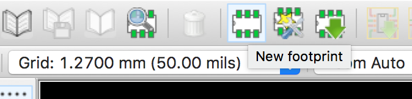
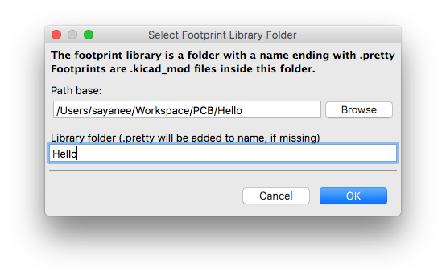
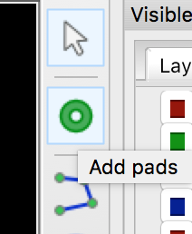
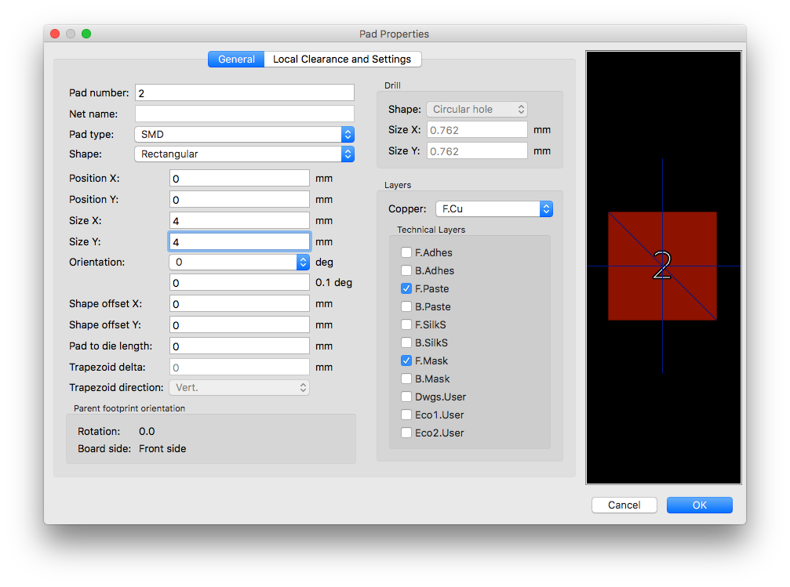

# Create footprint

1. Click `foot print editor`

  
- Click `New footprint`

  
- Save footprint in new library

  
- Select footprint folder

  
- Select footprint wizard

  
- Choose footprint library folder

  
- Add library to current project

  
- Select active library

  
- Select library footprint

  
- Ensure the footprint is part of active library

  
- Add pads

  
- Press `e` to edit the pad

  
- Add polygon

  
- Save
