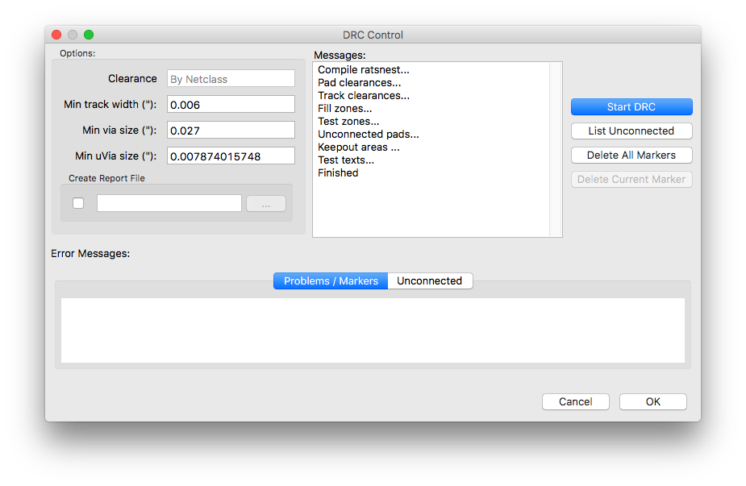
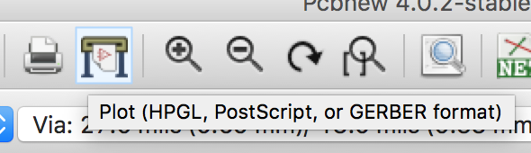
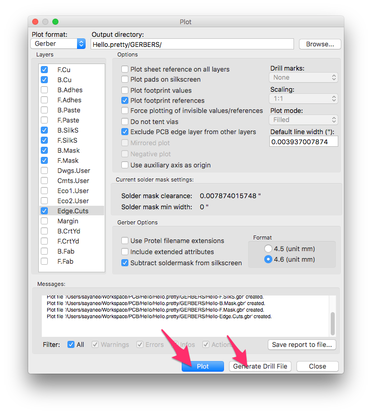
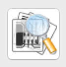

# Gerber

## Todo

1. Design rules check
1. Generate Gerber and Drill files
1. View Gerber

## 1. Design rules check

1. Open `PCB Editor`

  
1. Perform design rules check

  

  

## 2. Generate Gerber and Drill files

1. Open `PCB Editor`

  
1. Click `Plot`

  

  

  
1. Check files generated

  

## 3. View Gerber

1. Open GerbView

  
1. Load Gerber file

  
