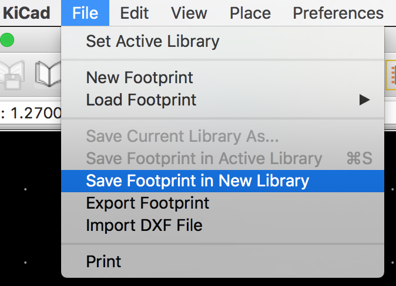
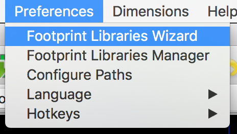
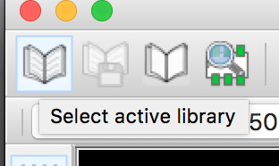
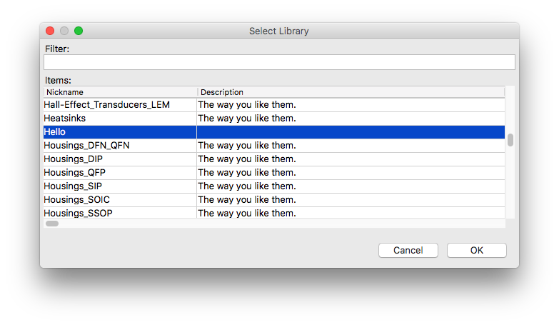
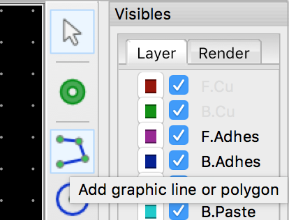

# Create footprint

1. Click `foot print editor`

    
1. Click `New footprint`

    
1. Save footprint in new library

    
1. Select footprint folder

    
1. Select footprint wizard

    
1. Choose footprint library folder

    
1. Add library to current project

    
1. Select active library

    
1. Select library footprint

    
1. Ensure the footprint is part of active library

    
1. Add pads

    
1. Press `e` to edit the pad

    
1. Add polygon

    
1. Save
