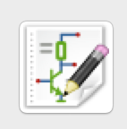
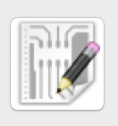
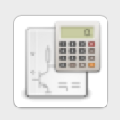

# New symbols

1. Eeschema - Electronics Schematic Editor

    
1. Schematic Library Editor

    
1. PCB new - Printed Circuit Board editor

    
1. PCB footprint editor

    
1. GerbView - Gerber Viewer

    
1. Bitmap to component - convert bitmap images to Eeschema or PCBnew element

    
1. PCB calculator

    
1. PI Editor - worksheet layout editor

    
