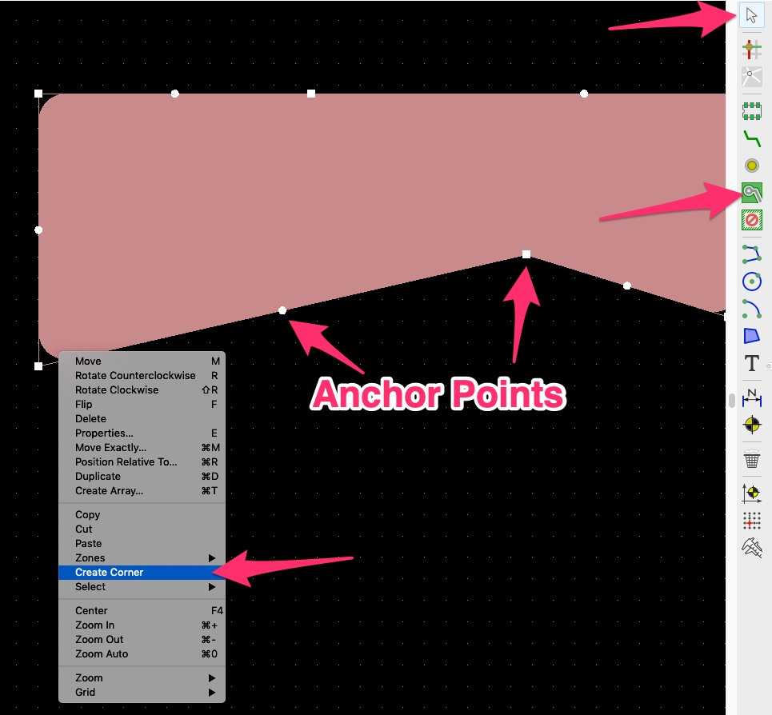
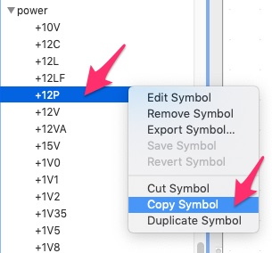

# KiCad 5.0

## Adding new footprint libraries

This allows another user on another computer to access the library within the project specific directory.

1. Open the KiCad project folder outside the KiCad program
1. Create a folder called `library` in the project
1. Copy and paste `*.pretty` folder from another location
1. Go to `Preferences` > `Manage footprint libraries` > `Project specific libraries` tab
1. Choose the `*.pretty` folder from the `library` directory

## [A faster way to update your layout](https://www.youtube.com/watch?v=FO7sArFLOdk)

### Before

1. Edit schematic
1. Annotate schematic
1. Generate Netlist
1. Import Netlist in footprint layout

### After

1. Ensure footprint components are locked down!
1. Edit schematic
1. Go to `Tools` > `Update PCB from Schematic...`
1. Check again to ensure footprint layout is not broken

## ⁉️ [Grid origin, Drill and place offset and layer alignment targets](https://www.youtube.com/watch?v=lWyEiKdQi4k)

1. Footprint layout sidebar > `Set origin point for the grid`
1. Plot GERBER format
1. Check `Use auxiliary axis as origin`

## [Drawing and modifying planes](https://www.youtube.com/watch?v=jEDCzisf0Rk)

1. Check the zone in `Layers`
2. Check grid size as required
3.  Select the first `Arrow` tool
4. Select the zone
5. See the tiny square and circle anchor points
6. Drag the anchor points according to the shape 
7. Create a new Anchor Point on the zone linke with  `Right Click` > `Create Corner`

## [Copying symbols from one library to another](https://www.youtube.com/watch?v=Dd7KLLg59O0)

1. Go to the Schematic
2. Go to the Symbol Editor with the icon at the top menubar `Create, Delete, Edit Symbols`
3. Select the symbol to copy
4. `Right click` > `Copy symbol`
5. Go to another symbol group to paste the symbol with `Right Click` > `Paste Symbol`
6. Remove the symbol with `Right Click` > `Remove Symbol`

## [Modern Toolset (Push & Shove Router)](https://www.youtube.com/watch?v=wkL0WoKleYU)

1. Go to the foot print layout
2. Select the `Route Track` symbol
3. Start drawing the track
4. Change route settings with `Right Click`> `Interactive Router Settings` > `Mode` > `Shove`

## [Switching from 2 layer to 4 layer](https://www.youtube.com/watch?v=OBY1GuCmgPY)

Go to `Setup` in the menubar > `Layers Setup` > Section `Preset Layer Groupings` dropdown > Choose `Four layers, parts on front and back` 

## [Pad Mask Clearance](https://www.youtube.com/watch?v=qrlE_UGiBuU)

1. **(Global) For all footprints:** Go to footprint layout > `Setup` > `Pad to Mask clearance`
2. **(Component) For specific footprint:** Highlight the component pads > Hit `e` for edit > View `Footprint properties` > `Local settings` section
3. **(Pad) For specific pad:**

## [Flipping your view in PCBnew](https://www.youtube.com/watch?v=OwOlJv5TwrA)

How to vertically flip the board especially for the back layer so that it appears exactly as real life?

Go to `View` > `Flip board view`

## [3D Viewer](https://www.youtube.com/watch?v=lu41QO-K7GQ)

- `z` and `shift + z` to view the board on the Z-axis
- `y` and `shift + y` to view the board on the Y-axis
- `x` and `shift + x` to view the board on the X-axis
- Click `Settings` to turn on and off components and layers in view
- Change Silkscreen color with `Preferences` > `Choose Colors` > `Silkscreen color`

## [Blind and Buried Vias](https://www.youtube.com/watch?v=H8tPb9ekhLw)

1. Go to footprint layout
2. Go to `Setup` > `Design Rules` > `Design Rules Editor` > `Global Design Rules`> Check `Allow blind/buried vias`
3. Open the `3D Viewer` > Settings > Uncheck `Show board body`> View the through, buries and blind vias

