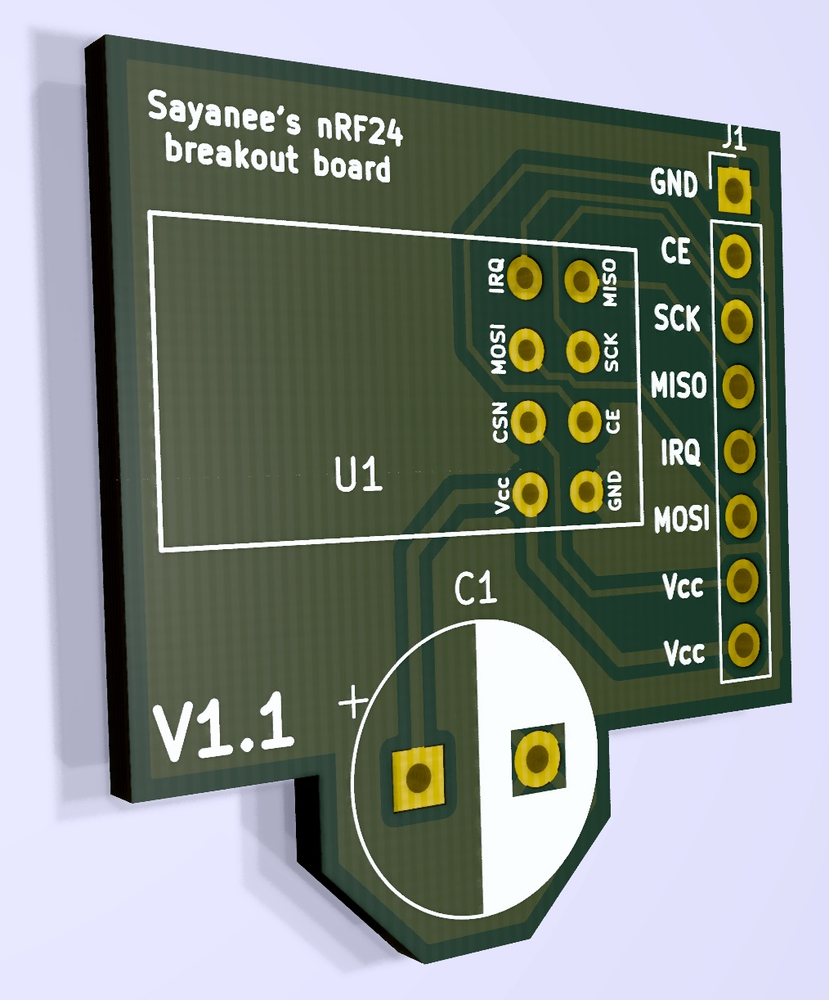
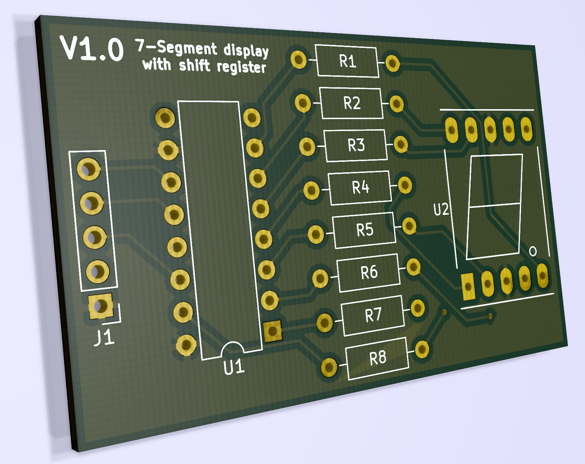
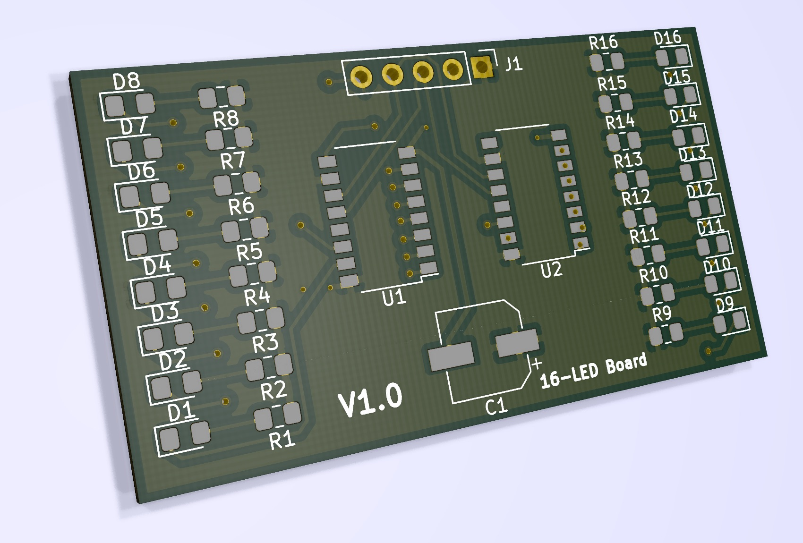
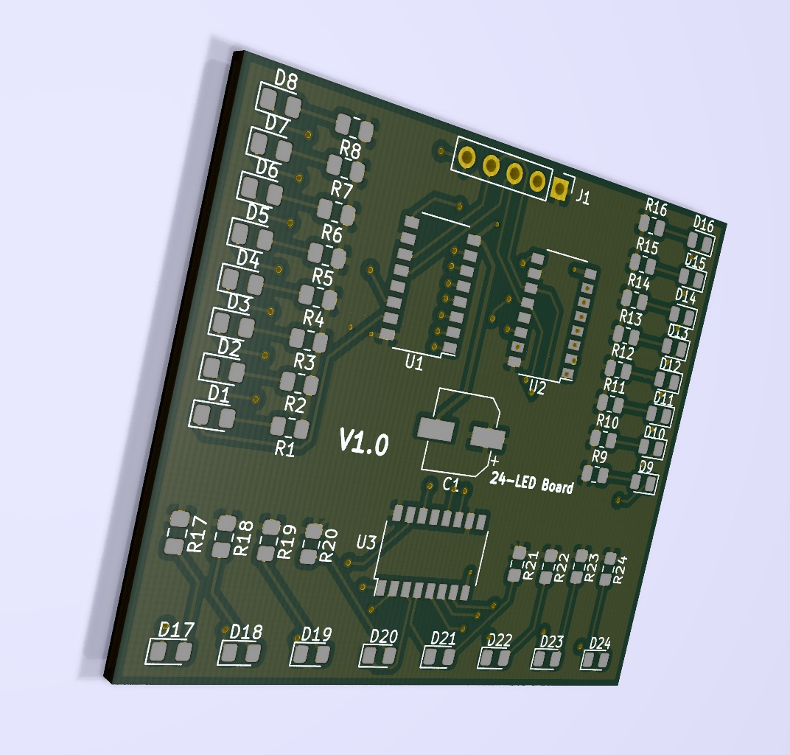

# KiCad like Pro [[link](https://www.udemy.com/kicad-pro/)]

## Main components

1. **Eeschema** - Schematic Layout editor with files `*.sch`, `*.lib`, `*.net`
    - Symbol library editor
    - **CvPcb** - Associate components in schematic to footprints
    - Rules check
    - Generate netlist
1. **Pcbnew** - PCB Layout editor with files `*.kicad_pcb`, `*.kicad_mod`
    - Design rules check
    - Footprint library editor
    - **GerbView** - Gerber viewer with files `*.g\*`, `*.drl`

## KiCad 5.0.1 project files

- [nRF24 breakout board](nRF24-breakout)
    
- [7-segment display board](SevenSegmentDisplayBoard)
    
- [16-LED-board](16-LED Board)
    
- [24-LED-board](24-LED Board)
    
