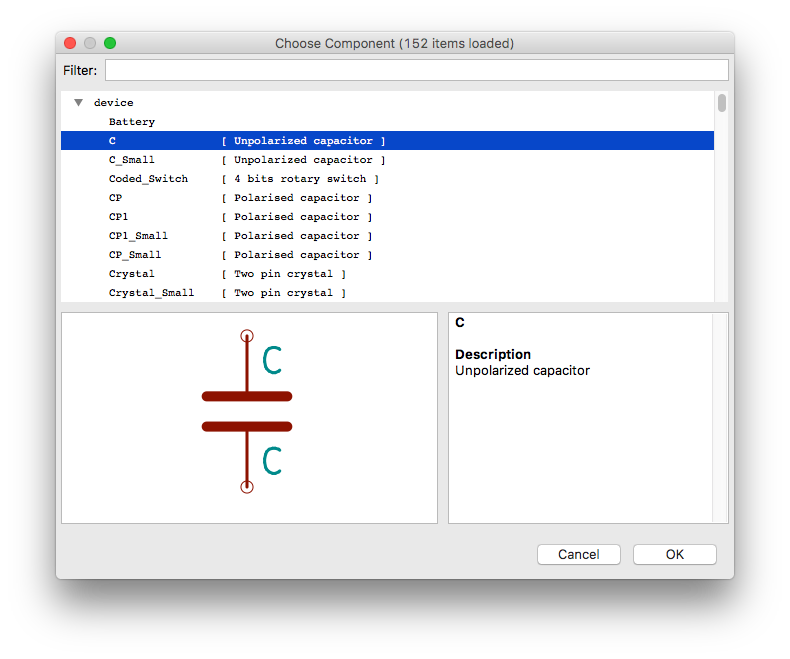
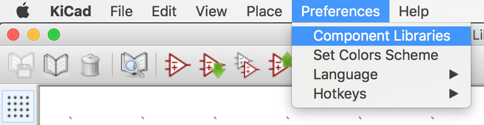

# Create library

1. Click `Schematic library editor`

    
1. Click `Select working library` in the menu bar

    
1. Select `device` in the list of libraries. Click `OK`.

    
1. Click `load component to edit from the current library`

    
1. Select a simple unpolarised capacitor as the first component of the library

    
1. Create new library

    
1. Save new library as `{NAME}.lib` in the project folder
1. Add new library to the list `Preferences > Component Libraries`

    
    
1. Click `Select working library` in the menu bar to choose the newly created library

    
    
1. Ensure the new library name and filepath can be seen in the status bar above

    
