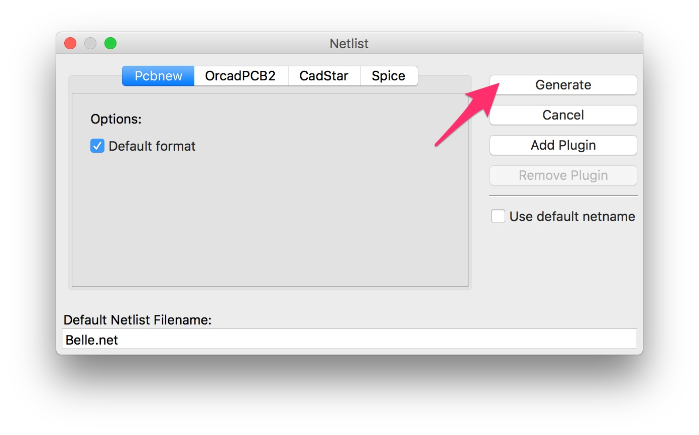
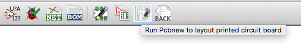

# Create schematic

## Things to do

1. Add components, wires, labels, power, edit components
1. Annotate schematic
1. Perform electrical rules check
1. Generate net list
1. Associate component with footprint

## Editing schematic

### 1. Add components

1. Open schematic editor

    
1. Press `a` to `add component`

    
1. Press `w` to add wires for joining components

    
1. Press `l` to add labels

    
1. Press `p` to add power

    
1. Press `v` to edit values of components

    

### 2. Annotate

1. Click `annotate` to annotate the schematic
1. Choose the annotation options

    

### 3. Perform electrical rules check

1. Click `Perform electrical rules checks`

    
1. Add options for electrical checks

    

### 4. Generate net list

1. Click `generate net list` in the menu

    
1. Save net list in the project folder as `*.net`

    

### 5. Associate component with footprint

1. Click `run CvPCB to associate components and footprint`

    
1. Associate each component with footprint

    
1. Re-generate the net list
1. Layout PCB

    
1. Read netlist in layout PCB

    
1. Click `Generate`

    
1. Save NetList

    
1. Run PCB New

    
