# Create schematic

## Things to do

1. Add components, wires, labels, power, edit components
- Annotate schematic
- Perform electrical rules check
- Generate net list
- Associate component with footprint
- Generate PCB layout
- Check design rules
- Fill zones
- Connecting vias
- Creating Silk Screen

## Editing schematic

### 1. Add components

1. Open schematic editor

  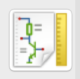
- Press `a` to `add component`

  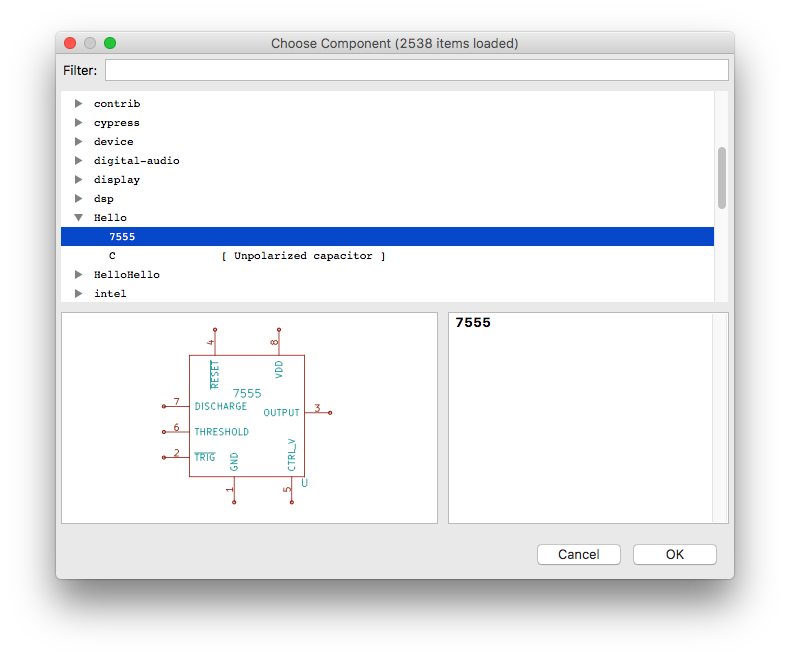
- Press `w` to add wires for joining components

  
- Press `l` to add labels

  
- Press `p` to add power

  
- Press `v` to edit values of components

  

### 2. Annotate

1. Click `annotate` to annotate the schematic
- Choose the annotation options

  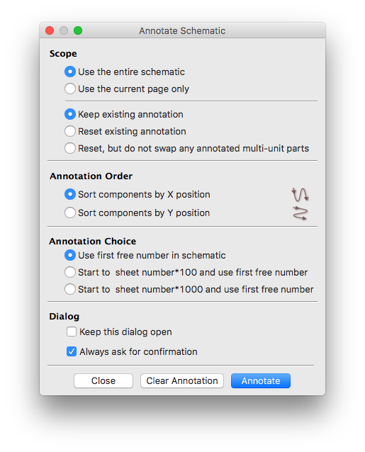

### 3. Perform electrical rules check

1. Click `Perform electrical rules checks`

  
- Add options for electrical checks

  

### 4. Generate net list

1. Click `generate net list` in the menu

  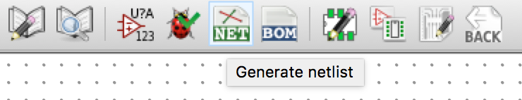
- Save net list in the project folder as `*.net`

  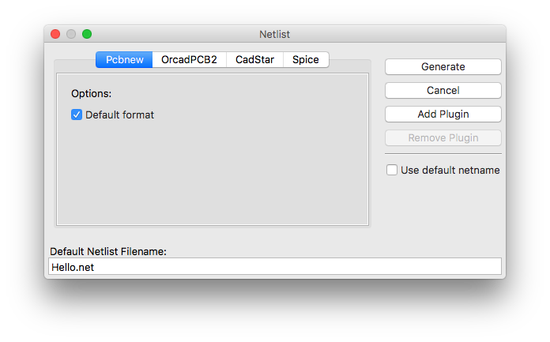

### 5. Associate component with footprint

1. Click `run CvPCB to associate components and footprint`

  
- Associate each component with footprint

  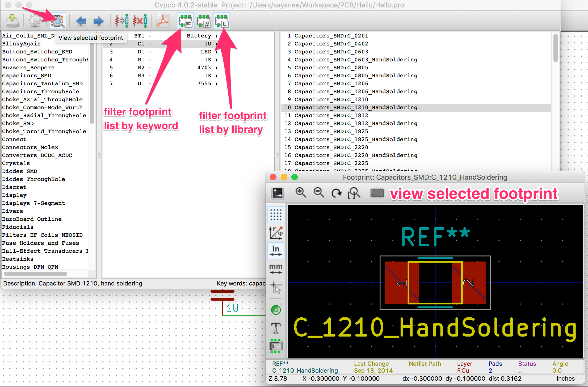
- Re-generate the net list
- Layout PCB

  
- Read netlist in layout PCB

  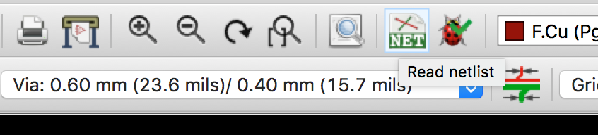

### 6. Generate PCB

1. Generate PCB

  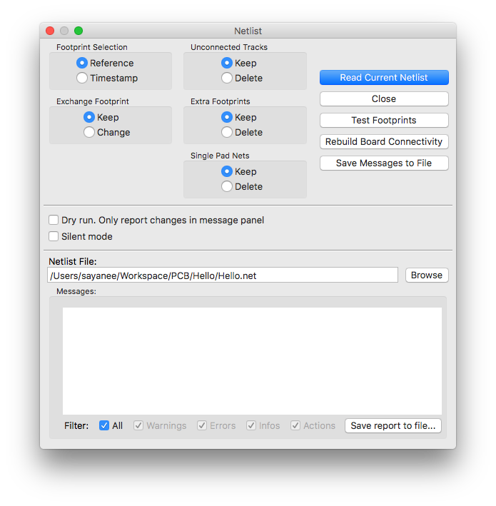

  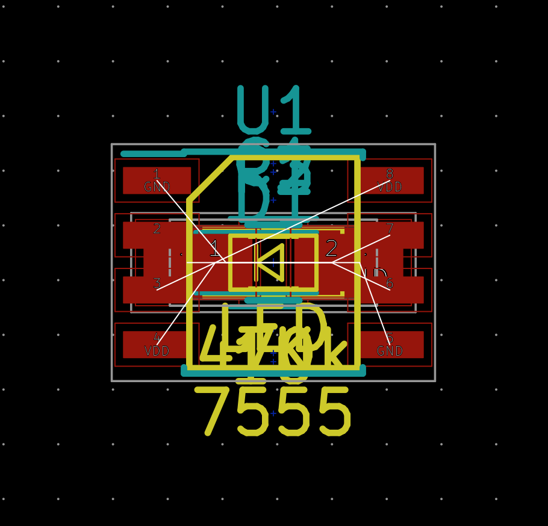
- Select footprint mode

  
- Spread out all footprints

  
- Press `m` to move components
- Press `f` to flip to the backside of the PCB
- Right click to select bigger grid

  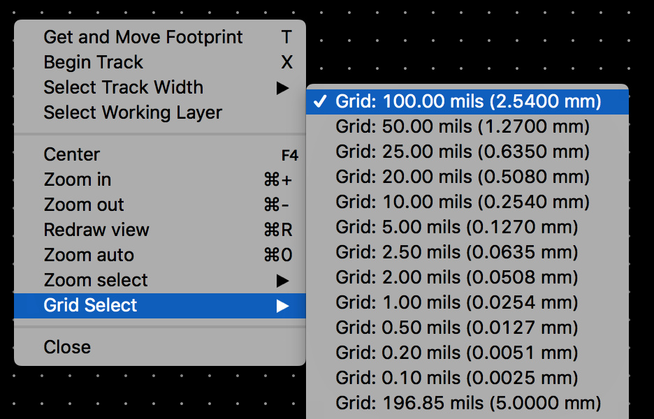
- Press `space` to set the `(0,0)` point on the PCB

  
- Change to edge cuts layer

  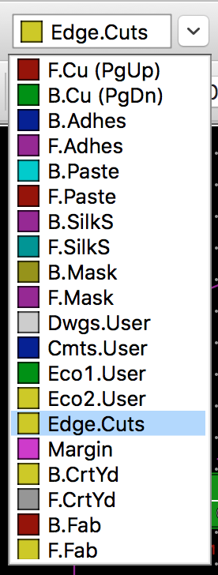
- Select graphic line tool

  

### 7. Check design rules

1. Check design rules

  
  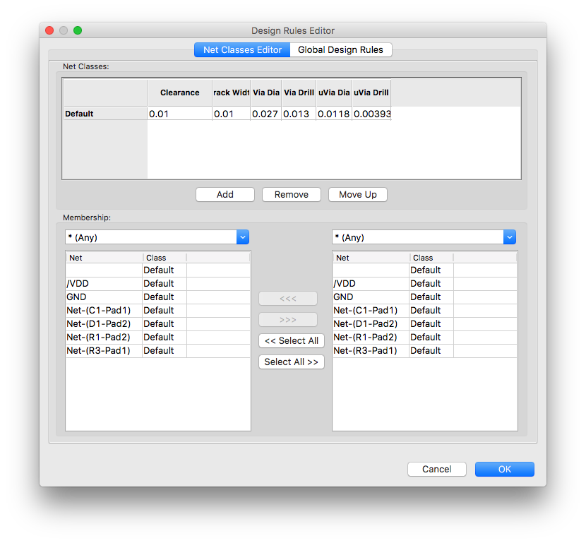
  
- Ensure track and via sizes

  

### 8. Add tracks and vias

1. Add track by choosing the upper copper layer

  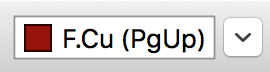
- Choose `Add tracks and vias`

  

### 9. Fill zones

1. Click `fill zones`

  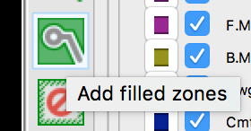
- Click and add **front copper fill**

  
- OR Click and add **back copper fill**

  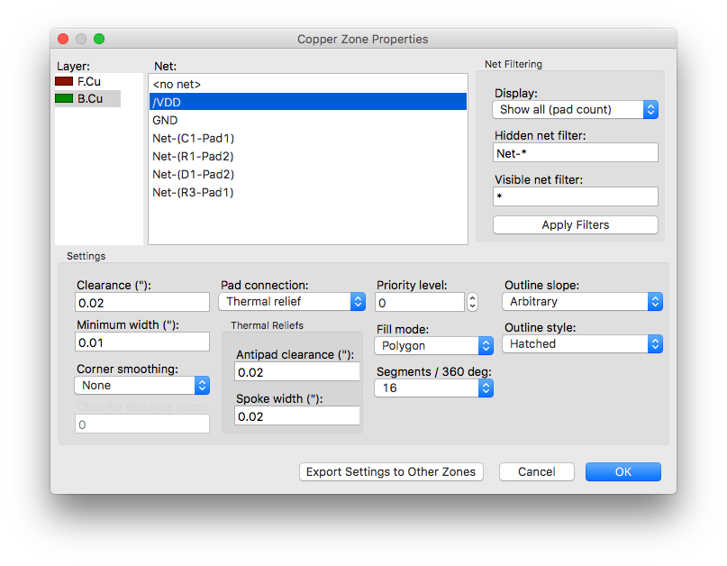
- Right click to `Fill or Refill zones`

  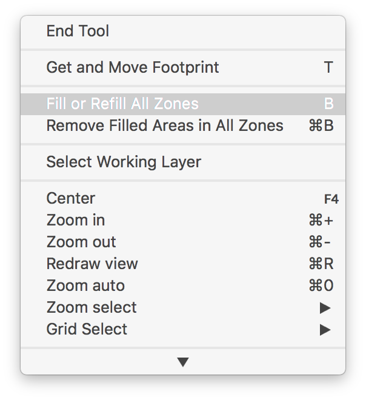

### 10. Connecting via

1. Click `v` to drop a via
- Double click to finish
- Hit `b` to redraw

### 11. Creating Silk Screen

1. Choose silk screen layer

  
- Choose Text editing

  
- Add in text manually

  
