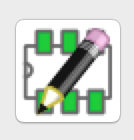
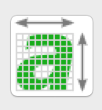

# New symbols

1. Eeschema - Electronics Schematic Editor

  
- Schematic Library Editor

  
- PCB new - Printed Circuit Board editor

  
- PCB footprint editor

  
- GerbView - Gerber Viewer

  
- Bitmap to component - convert bitmap images to Eeschema or PCBnew element

  
- PCB calculator

  
- PI Editor - worksheet layout editor

  
