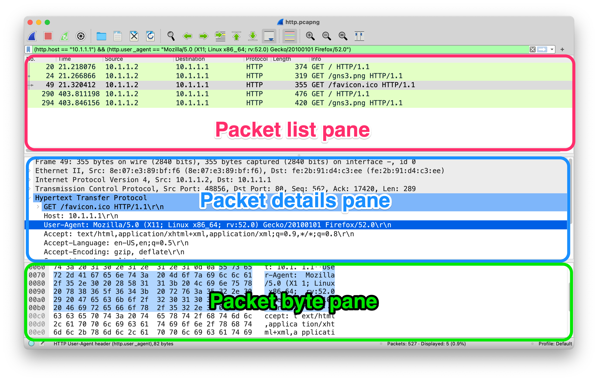
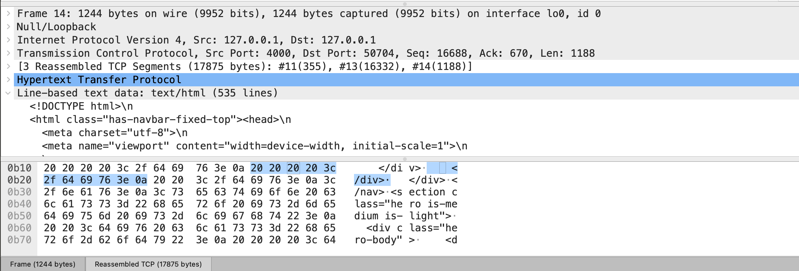
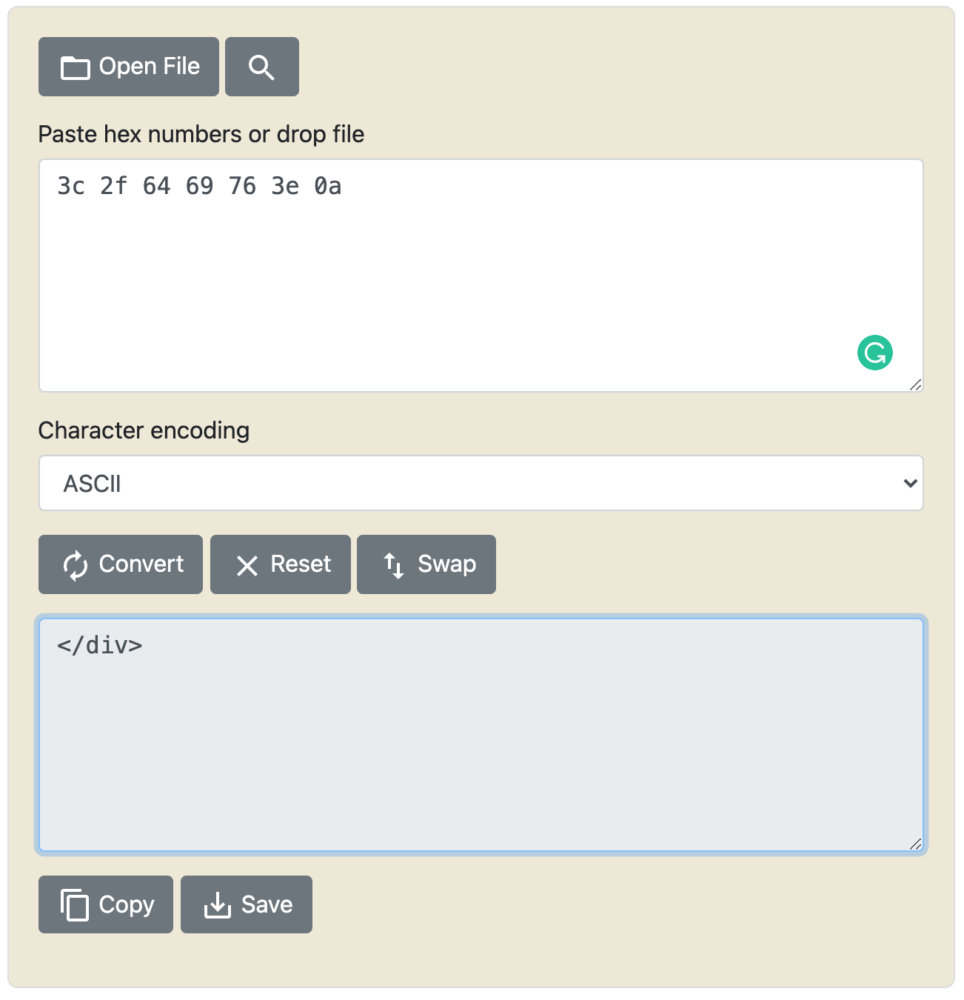
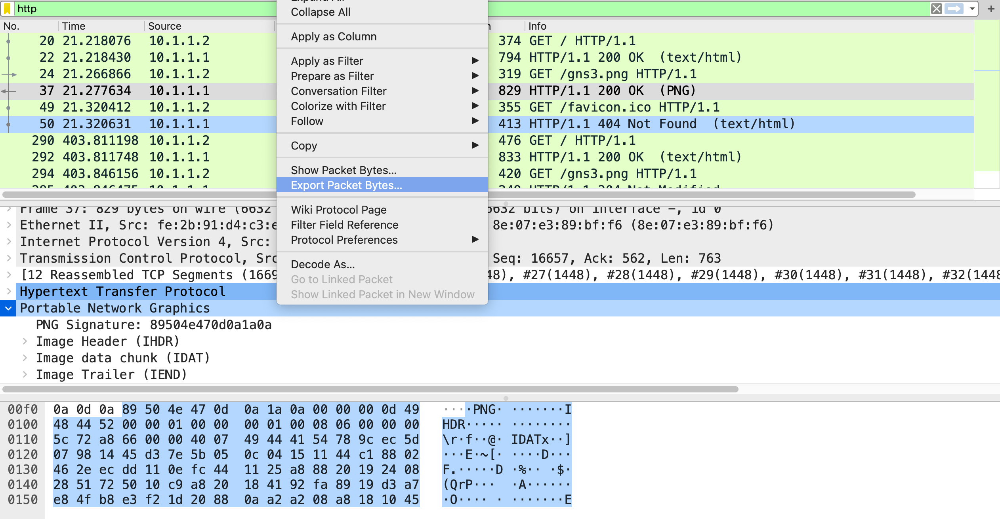
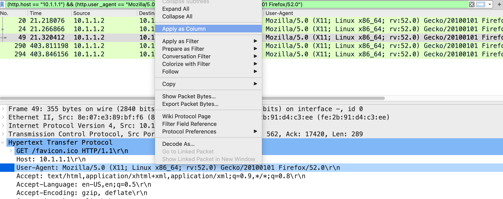

# Wireshark

<!-- START doctoc generated TOC please keep comment here to allow auto update -->
<!-- DON'T EDIT THIS SECTION, INSTEAD RE-RUN doctoc TO UPDATE -->

- [OSI Layer](#osi-layer)
- [Decode HTML code](#decode-html-code)
- [OSI Model](#osi-model)
  - [Advantages](#advantages)
  - [Layers](#layers)
  - [Encapsulation](#encapsulation)
- [Capture filters](#capture-filters)
- [Hacking passwords](#hacking-passwords)
- [Tips](#tips)
  - [Don't type filter manually](#dont-type-filter-manually)
  - [Add new columns](#add-new-columns)
  - [Profiles](#profiles)
  - [Statistics](#statistics)
- [Command Line Interface](#command-line-interface)
  - [tshark](#tshark)
  - [Termshark](#termshark)

<!-- END doctoc generated TOC please keep comment here to allow auto update -->

## OSI Layer

Open capture `WiFi: eno0`

- Data Link Layer (Layer 2): Ethernet
- Network Layer (Layer 3): IP
- Transport Layer (Layer 4): TCP, UDP
- Application Layer (Layer 5): HTML

## Decode HTML code

1. Run a local webpage at `localhost:4000`
1. Start capture in Wireshark with `Loopback: lo0`
1. Hit refresh on the browser with `localhost:4000`
1. Expand `Line-based text-data: text/html`
1. Select a part of the text
    
1. Copy a part of the hex numbers in a [convertor](https://www.rapidtables.com/convert/number/hex-to-ascii.html)
1. Convert hex to ascii
    

## OSI Model

### Advantages

- Inter-operability
- Layered approach
- Multiple vendors
- Split development
- Standards
- Quicker development

### Layers

*All people sleeping through networking don't pass*

1. Physical (bits) - Network engineer
    - copper, fiber, wireless, dsl
1. Datalink (frames) - Network engineer
    - MAC
1. Network (packets) - Network engineer
    - BGP, IS-IS, OSPF
1. Transport (segments) - Network engineer
    - TCP, UDP, VoIP
1. Session - Application engineer (web developer)
    - NetBIOS, PPTP
1. Presentation - Application engineer (web developer)
    - JPEG, HTML, ZIP,
1. Application - Application engineer (web developer)
    -  FTP, Telnet, HTTP, IMAP, POP3, SMTP

### Encapsulation

Each layer only communicates with the equivalent layer on another device.

| User data | Layer 7 | Layer 6 | Layer 5 | Layer 4 | Layer 3 | Layer 2 |
| --- | --- | --- | --- | --- | --- | --- |
| User data | L7 header |
| User data | L7 header | L6 header |
| User data | L7 header | L6 header | L5 header |
| User data | L7 header | L6 header | L5 header | L4 header |
| User data | L7 header | L6 header | L5 header | L4 header | L3 header |
| User data | L7 header | L6 header | L5 header | L4 header | L3 header | L2 header |
| Bits|

## Capture filters

- by source ip address: `ip.src==10.0.1.22 or ip.src==10.0.1.33`
- by protocol: `icmp` or `arp`
- by destination ip address: `ip.dst==10.1.1.254`

## Hacking passwords

Be careful of using protocols such as Telnet, TFTP, FTP, HTTP and don't use clear text protocols.

Retrieving PNG picture from raw data:

1. Use capture filter `http`
1. Loop for `PNG` in Info column
1. Expand `Portable Network Graphics`
1. Right click `Export packet bytes`
    
1. Save as `<NAME>.bin`
1. Rename as `<NAME>.png` and view the image

## Tips

### Don't type filter manually

Choose filter from the **Packet List pane** or **Packet Details pane**:

- Right-click > Apply as Filter > Selected
- Right-click > Apply as Filter > and Selected

### Add new columns

Add data from the Packet Details pane as a column in Packet List pane:

1. Right-click in Packet Details pane
1. Choose `Apply as Column`

### Profiles

Uses:

1. Zoom level
1. Filters
1. Columns
1. GUI Preferences

Add a new profile:

- Menu > Edit > Configure Profiles or
- Right-click bottom-right Profile

### Statistics

- Menu > Statistics > Endpoints
- Menu > Statistics > Protocol Hierarchy
- Menu > Statistics > Conversations
- Menu > Statistics > Flow Graph

## Command Line Interface

### tshark

Capture traffic without a GUI, the CLI way with [various options](https://www.wireshark.org/docs/man-pages/tshark.html)!

- `tshark --interface lo0` to capture local loopback
- `tshark --interface lo0 -w localhost.pcap` to write the raw output to a file named `localhost.pcap`
    - open the `*.pcap` file in Wireshark on another device

### Termshark

View `*.pcap` file in command line interface.

- `termshark -r localhost.pcap`

--> Continue
- Section 10: Python Wireshark scripting
- Section 11: Python Wireshark Password Captures
- Section 23: Port Security
